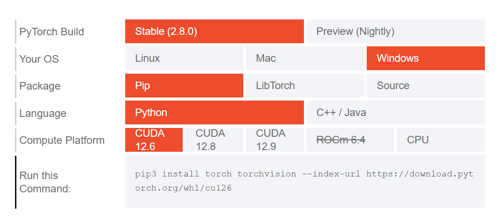

# astrbot_plugin_spark_tts

## 前言

本插件为对AstrBot的TTS功能补充，使用Spark TTS 的 0.5B 本地版本

>[!TIP]
>使用本插件前需要确保`FFmpeg`已安装并配置到环境变量中。
>
>实测建议该插件运行在Python 3.12和Python 3.10都可运行。

## 配置

### 基础版 

先安装依赖项
```bash
pip install -r requirements.txt
```

`Windows`用户也可参考[installation of Spark-TTS for Windows](https://github.com/SparkAudio/Spark-TTS/issues/5)进行安装

此时你安装的是`CPU`版的torch，如需安装`GPU`版的torch，请参考下面的步骤。

### 安装特定版本的`torch` (可选)

>[!TIP]
>此处以`Nvidia`显卡为例，如果你使用的是`AMD`显卡，请参考[PyTorch官网](https://pytorch.org/get-started/locally/)的安装指南使用·或其他版本。

先检查是否安装了正确的显卡驱动和CUDA版本
```bash
nvidia-smi
```

可以在输出中查看CUDA版本。如：
```
CUDA Version: 12.6
```

那么便可以如图选择对应版本并在命令行运行相应命令安装

</img>

## 使用

### 配置服务提供商

在 `AstrBot` WebUI中进入 `服务提供商` 界面，点击 `新增服务提供商`，点击 `文字转语音`，选择 `接入OpenAI TTS (API)`

填入 自定 `API Key`、`Base_URL`、`超时时间`

>[!TIP]
>在ID不冲突的情况下，ID可以保留字段
>
>API Key可以随便取(默认 `1145141919810` )，但不能为空
>
>Base URL 填入 `127.0.0.1:5080` 
>
>超时一般填`60`~`120`便可，按需填写

### 配置插件

在 `AstrBot` WebUI中进入 `插件管理` 界面，找到 `xiewoc / astrbot_plugin_spark_tts`，点击 `操作` -> `插件配置` 按需调整即可

>[!TIP]
>对于 `源音频文件` 即填写音频文件在插件文件夹下的`相对路径`即可

## 后记

本readme就先写到这，如果有不解或问题抑或是功能建议，请issue，只要在合理范围内，作者会尽力解决或实现的；


如果觉得这个插件对你有帮助，点个免费的star吧

# TODO

>1.进行长文本切割
>
>2.添加function calling功能
>
>3. ？？？
